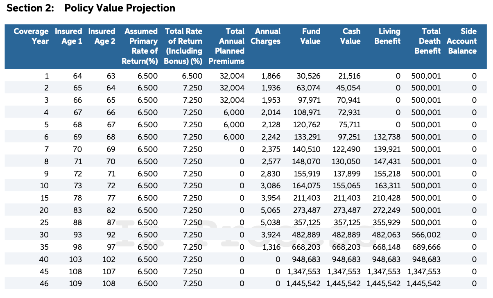

# ULSIM
Simulation of UL feasibility

## Backgroud
An insurance agent tried very hard to sell me a Universal Life insurance policy. The policy also provides *living benefits*, which allow you to borrow against the policy's cash value in the event of a critical illness. It sounded very enticing. Before purchasing the policy, I needed to determine whether it was a good deal and understand the implications of using the living benefits.

## What is the Concern

The YRT (Yearly Renewable Term) type universal life insurance policy consists of a yearly renewable term life insurance and a tax-free investment account. Each year, the insurance charge is deducted from the premium first and then from the investment account value if needed. If the premium exceeds the charge, the remaining money is added to the investment account.

The idea is that after a certain number of premium payments at the beginning years, the investment account's annual return becomes large enough to cover the insurance charge and to increase account value. 

However, because the annual charge increases exponentially with age, the investment account value may eventually be insufficient to cover the annual charge. As a result, the policy could collapse.

To sustain the policy, one must pay extra premiums if the fund value falls below the annual charge. Since extra payment typically required in the later years of the policy, the policy holder may be unable to afford the payment.

If the policy collapses while the policy holder is still alive, they will lose everything: no cash value and no death benefit. The policy is bad deal in such case. 

## Goal of the simulation
The objective is to determine the probability of policy collapse at various ages through simulation.

This simulation leverages two primary data sources:

### Policy Value Projection 
Below is the sales agent provide data. 

Please note:  
- The policy year data is not continuous after the 10th year, so we need to interpolate the missing years.  
- Additionally, the policy premium is very high during the first six years, after which no further payments are made.  
- The illustration assumed stable rate of return, which is not the normal case. 

### History S&P 500 rate of return data. 
The data includes yearly rates of return from 1926 to 2024, spanning a total of 99 years. Assume the money is invested in an index fund. The total fees (fund's MER + insurance fund fee) amount to 2%. 

Furthermore, 50% of the investment is allocated to the index fund, and the remaining 50% is allocated to a bond fund, which has a 2% return after deducting all fees. 

The rate of return (RR) is calculated as follows:
$$
RR = \left(\text{SPRR} - 2\%\right) \times 50\% + \text{BDRR} \times 50\%
$$

Where:
- **RR**: Overall rate of return.
- **SPRR**: S&P Index Rate of Return.
- **BDRR**: Bond Rate of Return.

## SIM1.XMLS
### Tab "Scenario1-raw". 
This is the original data from "Policy Value Projection"

### Tab "Scenario1-Interpolate"
This table add the rows missed between years by linear interpolation. 

### Tab "Scenario1-Interpolate"
- 2% of Premium sales tax. 
- $50 of Policy adminstration fee. 
- Policy face falue. 

### Tab "Calculation"
This is the meat. ToDo add more explainations. 

## Conclusion. 
With the payment schedule and historical rate of return, the probability of policy collapse at a certain age is shown in the table below.

For example, if the policyholder dies at the age of 95, the probability of policy collapse is 15%.

| Age | Possibility (%) |
|-----|-----------------|
| 91  | 1               |
| 92  | 4               |
| 93  | 6               |
| 94  | 7               |
| 95  | 15              |
| 96  | 20              |
| 97  | 24              |
| 98  | 29              |
| 99  | 34              |
| 100 | 39              |